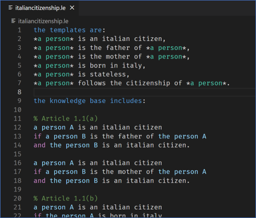
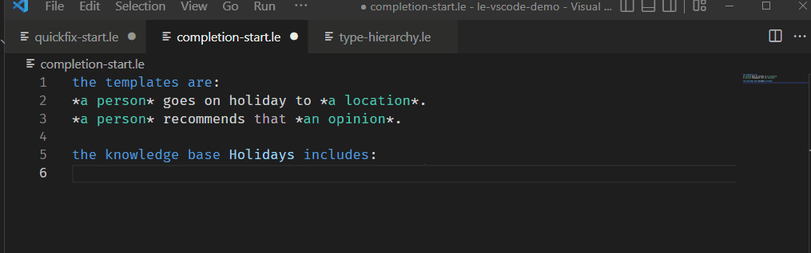
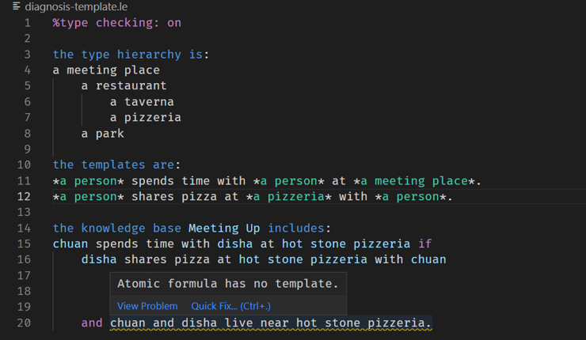
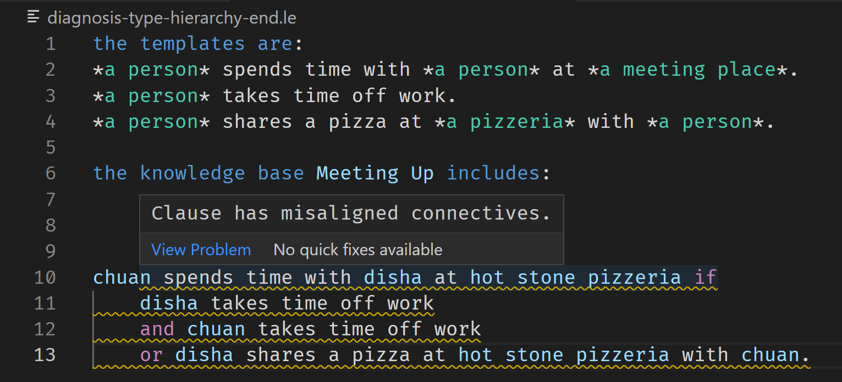
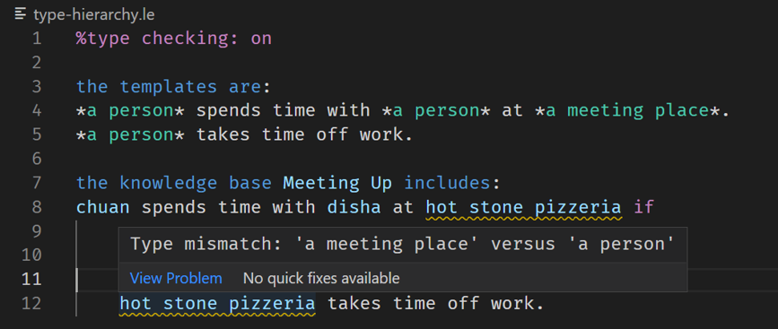
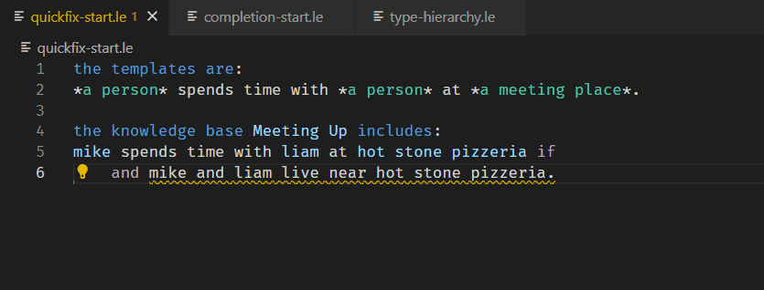

# Logical English editor for Visual Studio Code
Welcome to the Logical English editor extension for Visual Studio Code! 

The Logical English extension provides the following features:

## Syntax Highlighting
With smart syntax highlighting, Logical English is easier to read than ever!

## Code Completion
Your atomic formulas can be auto-completed for you!

## Template error detection
The Logical English editor will let you know if you...

 - write an atomic formula that has no matching template

 - use ambiguous indentation

 - give a term inconsistent types.

## Template Auto-Generation
The Logical English editor can auto-generate a template for a new atomic formula:

## We want your feedback!
This extension is very much a work in progress and is still being developed. If you have any requests, issues or comments, please share them with us by filling out [this form](https://forms.gle/K3HMpJ2nVuKPp5tG8). Your ideas will help influence the next version of the editor!

## How the Logical English editor was made
Up to version 1.1.9, the Logical English editor was made by Nikolai Merritt as part of a degree in MSc Computing Science. Nikolai Merritt has written a report on the process, which can be found at https://github.com/nikolaimerritt/dissertation/blob/main/dissertation.pdf .

## Full rights to the Owl Logo are owned by Alexei Merritt.
2022, alеxei mеrritt 111 at gmail dοt com

